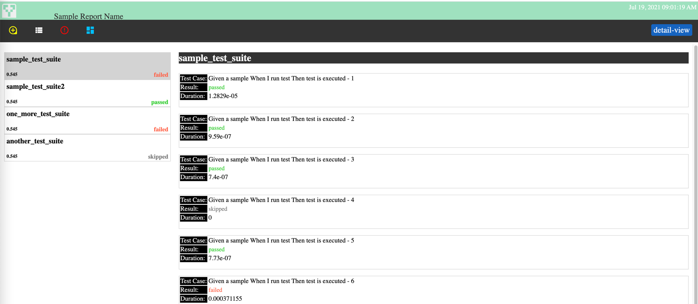
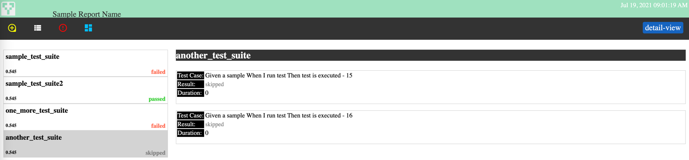
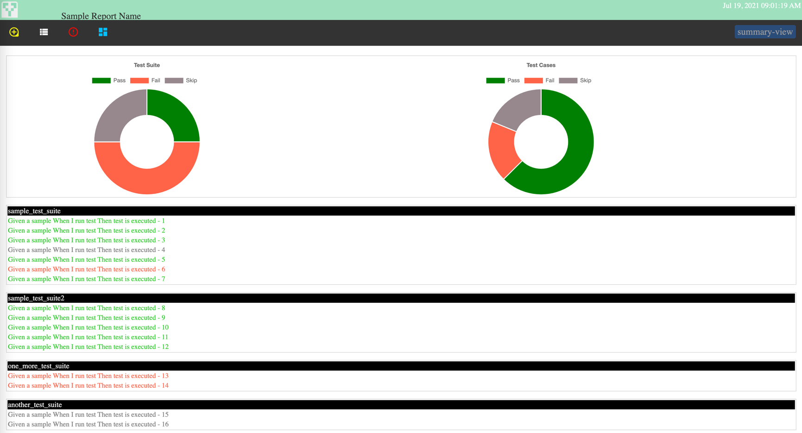
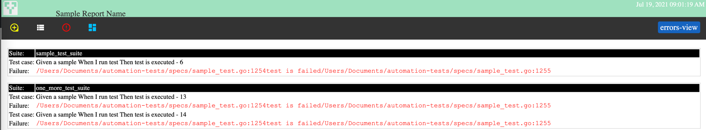
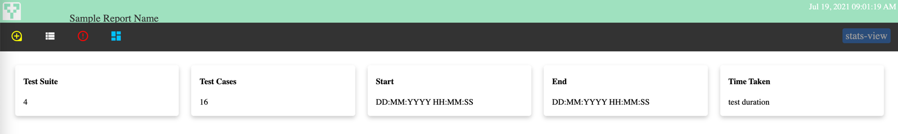

# Junit2HtmlGo

Simple Go implementation to generate HTML Report from Junit.xml reports. This can be integrated to generate the reports for [Ginkgo](https://github.com/onsi/ginkgo) test execution

# Usage
#### include the dependency in go.mod
```
    require (
            github.com/anshuljayn/Junit2htmlGo v1.0.4
        )
```

#### import the package
```
    import {
        "github.com/anshuljayn/Junit2htmlGo/src"
        }
``` 


#### List the junit files to be inlcuded in the report
```
    var jFiles []string
    jFiles = append(jFiles, "testdata/junit1.xml", "testdata/junit2.xml","testdata/junit3.xml","testdata/junit4.xml")
```

#### Set* the details for report:
```
    data:=src.ReportData{
		ReportName: "Sample Report Name",
		StartTime:  "Start time of execution",
		EndTime:    "end time of execution",
		Duration:   "test duration",
		BrandLogo:  "https://www.yourbranc.com/logo_url_here.png",
}
```
*if not set default values will be displayed - 

#### Either create **_Static Report_**:
```
    var reportfile:="staticReport.html"
    src.CreateReport(reportfile,jFiles,&data)
```

#### Or **_render_** the report : view the report http://localhost:8080/
```
    var port:=8080
    src.RenderReport(port,jFiles,&data)
```

### Sample Report









